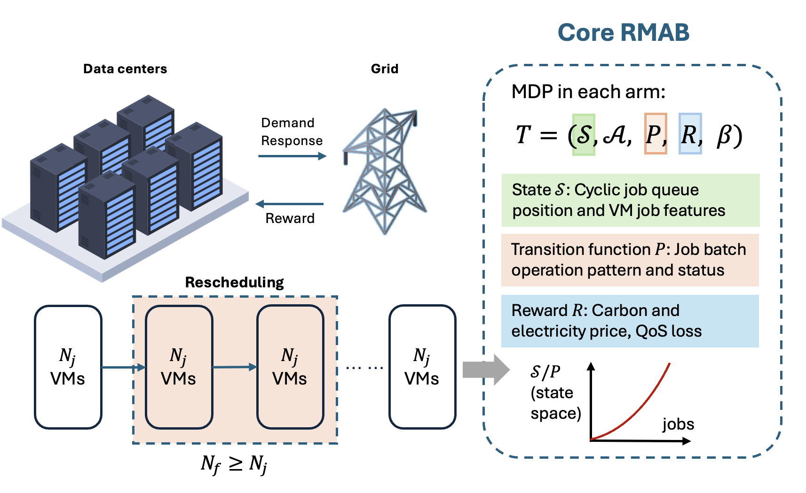
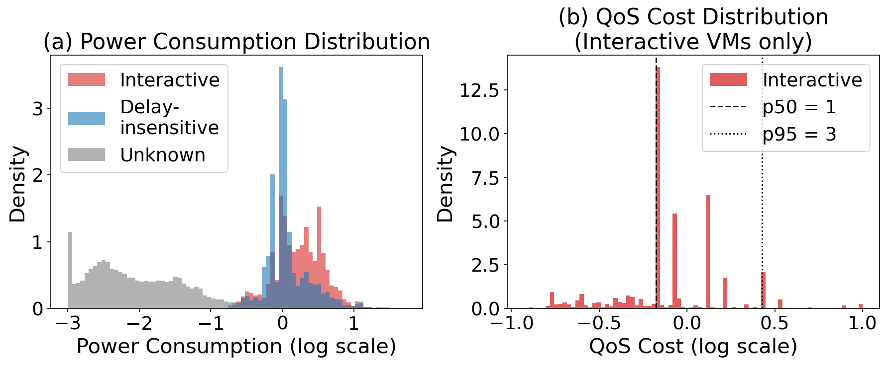
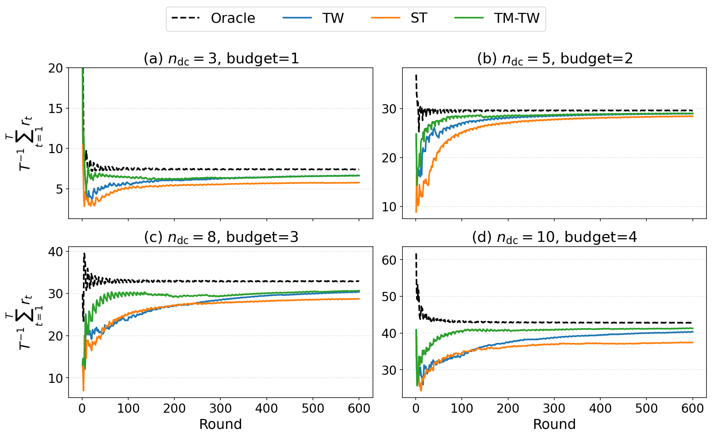
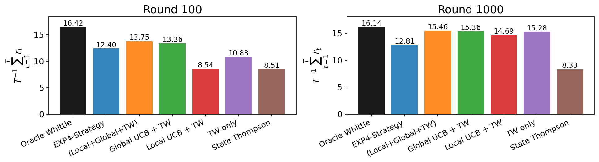

# RACER: Robust and Adaptive Computing and Energy Resource Coordination Framework

<p align="center">
  <a href="LICENSE"></a>
  <a href="https://www.python.org/downloads/"></a>
</p>

This repository contains the datasets and experimental results associated with the submission: *Robust Restless Multi-Armed Bandit for Data Center Flexibility Services Through Virtual Machine Scheduling*.



## 1. Data Center Dataset and Power/QoS Distribution

- `datasets/datacenter_with_metrics/datacenter_*_with_metrics.csv`
- `power_qos_distribution/power_qos_distribution.png`
- `power_qos_distribution/plot_power_qos_distribution.py`

Each CSV file represents one data center workload trace with VM-level resource, lifetime, ranking, power-saving, QoS-cost, and reward fields. Use the numbered files (`datacenter_0_with_metrics.csv` through `datacenter_19_with_metrics.csv`) as independent data center instances for experiments or comparisons.



Regenerate:

```bash
python power_qos_distribution/plot_power_qos_distribution.py
```

## 2. ST, TW, and TM-TW Performance Comparison

This experiment compares State Thompson (ST), Thompson-Whittle (TW), and Trust-mixed Thompson-Whittle (TM-TW) policies for adaptive scheduling across the data center instances.



Files are available in `st_tw_tmtw_comparison/`.

## 3. TM-TW Ablation Experiment

This ablation evaluates the contribution of the trust-mixing component in TM-TW by comparing reward outcomes against the EXP4 strategy and related variants.



Files are available in `tmtw_ablation/`.

Regenerate the two comparison plots:

```bash
python tmtw_ablation/replot_exp4_vs_ablation_reward.py
```

## 4. Sensitivity Experiments

These experiments test how performance changes under different workload sizes and contextual noise levels.

Files are available in `sensitivity/`.

Regenerate:

```bash
python sensitivity/replot_n_jobs.py
python sensitivity/replot_contextual_noise.py
```
